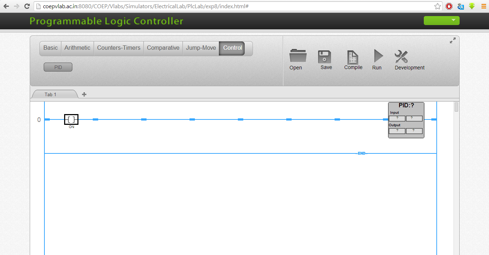
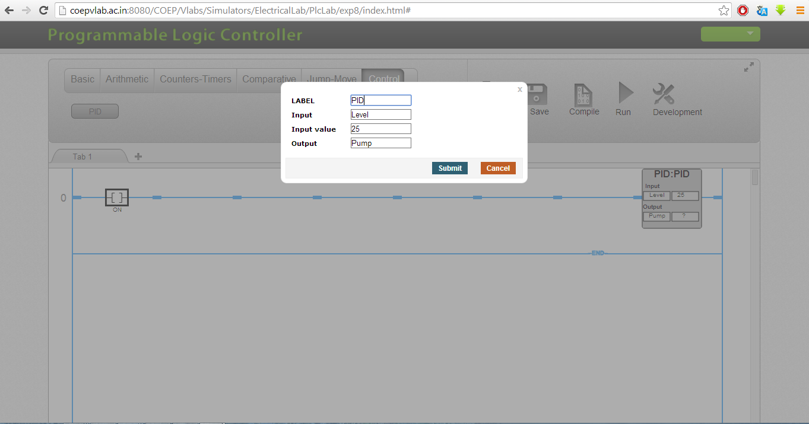
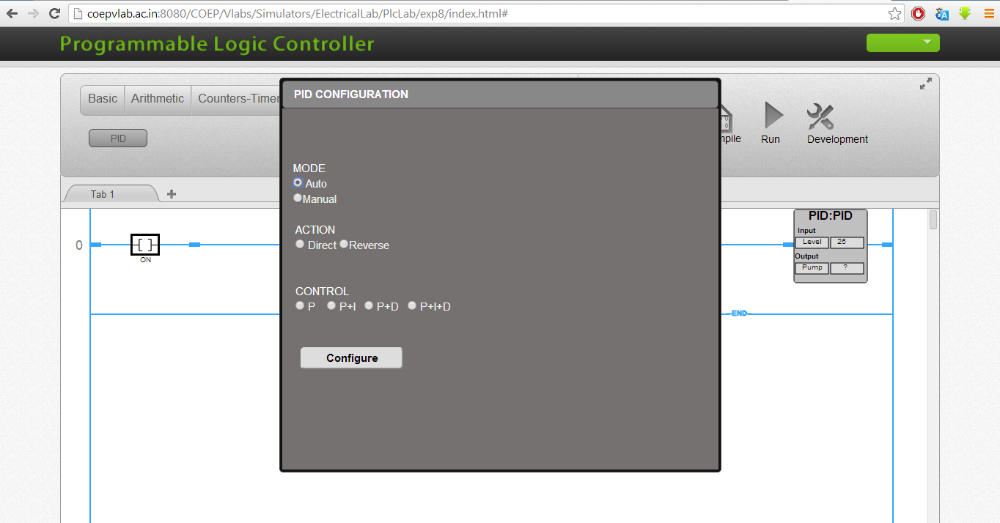
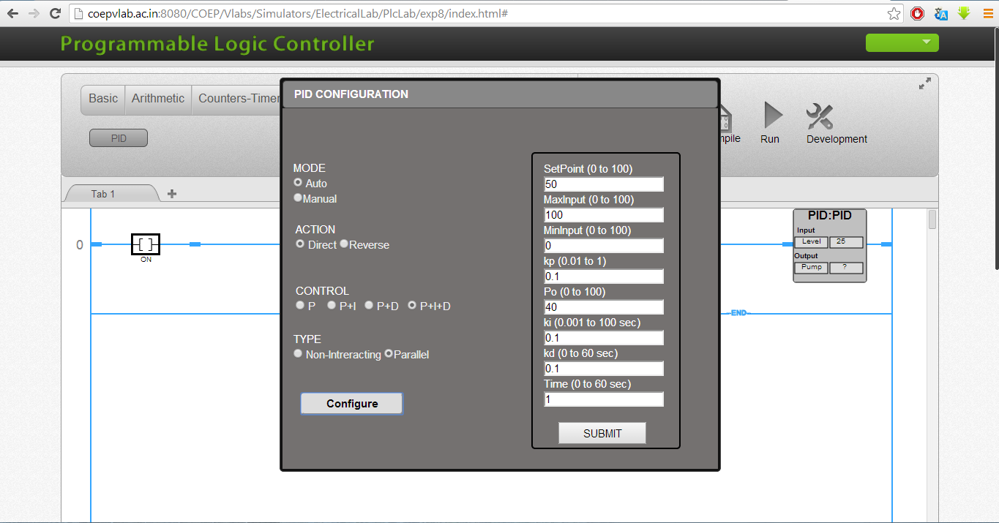

### Click on simulator link to understand PID opeartion.
1. Add a new to rung.
2. Click on PID tab to insert PID function block in the rung.
3. The screen will appear as follows.

4. Now right click anywhere on PID function block to configure the bolck.

5. Once you configure the tags , You can set the action, PID mode, type of PID etc. The screen will be as follows:

6. Click on Configure tab. Now you can set the tuning parameters and submit the same. See the following screen shot.

7. Now go to run mode and observe the PID output.

Repeat steps 3 to 7 for various configurations and different tuning parameters  
