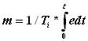
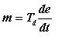
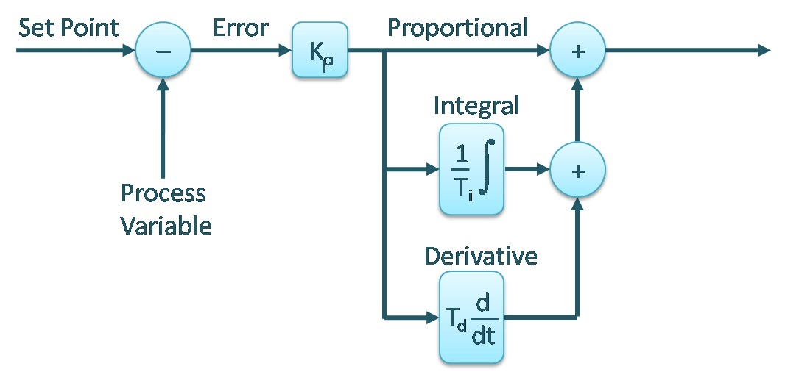
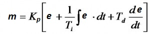
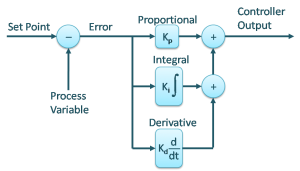

Programmable logic controller were originally designed to implement discrete or logical control. But it has limited capability of handling analog input and outputs as well as analog control. PID control is available in PLC as a function. The theory behind PID control is discussed here.
**In this experiment students are expected to study all features of the PID block available in PLC, in simulation mode without considering any process application.**
As the name suggests this strategy is preferred for on - off type applications. This is a simplest form of control. Chattering of contacts for final control element is major problem but it can be avoided by addition of dead zone. Precise control is not possible due to addition of dead zone.\
Mostly all domestic applications as Water Geyser, Electric iron, Electric Ovens are controlled using on-off control strategy.

**PID: Continuous Control**

There are 3 basic actions in PID.

* **P**roportional
* **I**ntegral
* **D**erivative

**Proportional mode:-**
In this mode the controller output varies linearly with respect to the error.
The equation for P mode is

    m = Kp * e + Po  

Where:\
m is the controller output.\
Kp is the gain of controller\
e is the error in %\
Po is the proportional Bias. (Value of m at e =0)

Due to addition of proportional bias, positive as well as negative errors are handled. Generally Po is set at 50% to handle equal positive and negative error range. Higher is the gain lower is the band to control.

**Integral mode:-** Integral mode is used to remove the offset produced due to P mode. Offset can either be positive and negative.
Equation for Integral mode is

Where,\
Ti is the integral time setting and t is the time.\
When this action is used alone due to integral effect the action becomes too slow. When combined with Proportional, the action may go into saturation which is called as Reset Windup. To overcome this, controller output is limited at lower and higher end. This is called as Anti reset windup. But due to addition of Integral action Offset is nullified.

**Derivative mode:-** This action is used to increase the speed of response of slow processes. It anticipates the rate of change of error and takes the control action. Equation for Derivative mode is

Where,\
Td is the derivative time.\
Set Point can be achieved quickly by using D mode. In noisy environment. this action is not used as the output goes into saturated condition. Even for constant error D action provides no correction, hence not preferred alone. It is always combined with P action.
Composite controller, i.e. P, I and D adds advantages of all the three modes.
The Equation for the combined controller depends on how P, I, D blocks are combined.
There are two commonly used configurations, Non-interacting and Parallel.
**Non-interacting PID controller algorithm:**

The equation for non-interacting controller is:

**Parallel PID controller algorithm:**

The equation for parallel algorithm is:

Loop tuning time can be optimized by using proper combination of PB, Ti and Td.
The process parameter analog value (PV) is given as input to the block. Various settings such direct or reverse action, Proportional band setting, Set point value, Proportional band, Proportional gain, Derivative gain, Integral gain etc. are configurable parameters available in PID function.
